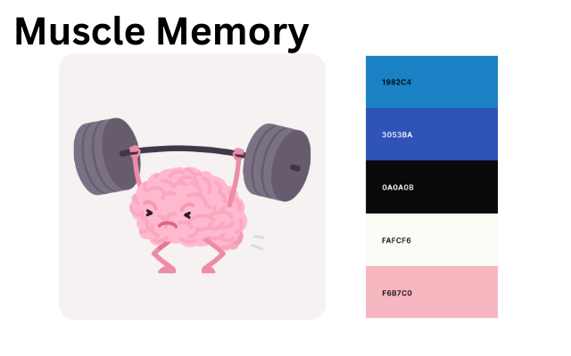

# MuscleMemory

## Table of Contents

1. [Overview](#Overview)
2. [Product Spec](#Product-Spec)
3. [Wireframes](#Wireframes)
4. [Schema](#Schema)
5. [Sprint Planning](#Sprint-Planning)
6. [Unit 8](#Unit-8)
7. [Unit 9](#Unit-9)
8. [Unit 10](#Unit-10)

## Overview

### Description

MuscleMemory allows users to record their workouts, tracking exercises, weights used, repetitions, sets, and the date/time of workouts. It's designed to help users maintain an organized log of their fitness journey.

### App Evaluation

- **Category:** Health & Fitness
- **Mobile:** MuscleMemory is tailored for mobile use, enabling users to log workouts as they happen and check their progress anytime, anywhere.
- **Story:** The app supports users in their fitness journeys by providing a powerful tool to track progress, stay motivated, and improve consistently. It appeals to fitness enthusiasts interested in detailed tracking of their exercise routines.
- **Market:** MuscleMemory targets a broad audience ranging from gym-goers to casual fitness enthusiasts. Its simple, user-friendly interface, combined with being a free app, positions it well in the competitive fitness app market.
- **Habit:** The app is designed to be a part of the user's daily routine, with features encouraging regular interaction such as workout logging reminders and progress notifications.
- **Scope:** The initial scope is focused on essential features like workout logging and progress tracking. This approach ensures a manageable project for development, with potential for future expansions such as social integration or advanced analytical tools.

## Product Spec

### 1. User Stories (Required and Optional)

**Required Must-have Stories**

* Users can log each workout session with details such as exercise, weight, repetitions, sets, and date/time.
* Users can view a history of their workout sessions in calendar view.
* Users receive notifications to encourage regular workout logging.

**Optional Nice-to-have Stories**

* Social media integration for sharing workout achievements.
* Analytical tools to provide insights based on workout data.

### 2. Screen Archetypes

- [ ] Home Screen
* Users can enter new workout details
* Users can view a summary of their week
* Users can configure app settings
- [ ] History Screen
* Users can scroll through past workouts and view details
* Users can toggle between calendar and list view

### 3. Navigation

**Tab Navigation** (Tab to Screen)

* Home / Log Workout
* Workout History

**Flow Navigation** (Screen to Screen)

- [ ] Home Screen
* Opens Log Workout modal or settings screen

- [ ] History Screen
* Opens workout details modal, and List view

## Wireframes

## Schema 

[This section will be completed in Unit 9]

### Models

[Add table of models]

### Networking

- Home Screen: They Said So Quotes API will provide daily motivational quotes

## Sprint Planning

### Main Features
1. Log Exercise Data: Name, Date, Time, Duration, Distance, Weight, Sets, Rep
- Add, Edit, Delete
2. Calendar View
- Days are marked, able to click on dates to view recorded workouts
3. List View
- Workouts can be viewed in descending order 
4. Local data persistence

### Sprint I (April 16-19)
- Set up GitHub
- Initialize XCode Project
- create Home screen with Log workout screen
- create calendar view for History Page
- functional tab navigation

### Sprint II (April 20-23)
- local data persistence
- networking feature for motivational daily quotes
- List view for History page

### Sprint III (April 24-29)
- Make sure all features are implemented and functional
- update UI and finalize app icon and color theme/ branding

## Unit 8
### Progress
- Brainstormed & finalized app idea
- Created GitHub and initialized Xcode project
- Made app icon & color story

### Video Walkthrough
[Guide](https://youtube.com/shorts/oIleeFb5uAI?feature=share)

## Unit 9
### Progress
- Created Home Screen
- Created Add Workout modal
- Established tab navigation

### Video Walkthrough
[Guide](https://youtube.com/shorts/xIrR5KJ1KaU?feature=share)

## Unit 10
### Progress
- Integrated They Said So Quotes API for daily motiviational quotes on home screen
- Added ability to edit and delete data entries
- added date to home screen
- established data persistence
- calendar view for workout data

### Notes
- I believe I have accomplished my MVP version of my app
- It was very fun to develop and learned a lot from mistakes and bugs
- I would love to continue this project beyond this course

### Final Video Walkthrough
[Guide](https://youtube.com/shorts/E7m_rcp_Nd0)